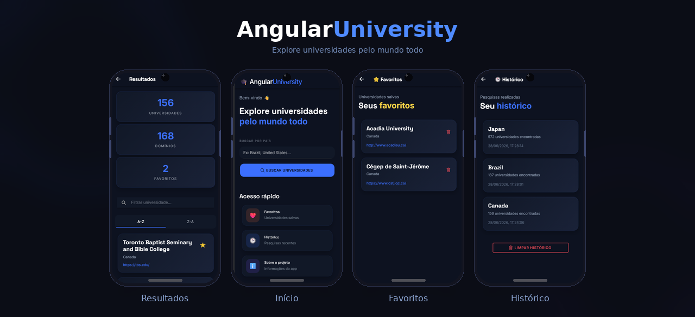

# 🎓​AngularUniversity

## 📱 Preview

<p align="center">
  
</p>

> Aplicativo desenvolvido com foco em **experiência do usuário**, **responsividade**, **identidade visual moderna** e **boas práticas de desenvolvimento front-end**.

---

## ✨ Funcionalidades

### 🔎 Busca de universidades

- Pesquisa de universidades por país
- Consumo de API REST pública
- Exibição dinâmica dos resultados

### 📊 Dashboard

- Total de universidades encontradas
- Quantidade de domínios únicos
- Total de favoritos salvos

### ⭐ Favoritos

- Adicionar universidades aos favoritos
- Remover favoritos
- Persistência utilizando LocalStorage

### 🕒 Histórico

- Armazenamento do histórico de pesquisas
- Exibição da quantidade de resultados
- Limpeza completa do histórico

### 🎨 Interface

- Tema dark customizado
- Design responsivo
- Animações suaves
- Navegação intuitiva
- Identidade visual própria

---

## 🛠️ Principais Tecnologias Utilizadas

<div align="center">


</div>

<br>

| Tecnologia | Descrição                             |
| ---------- | ------------------------------------- |
| Angular    | Framework principal da aplicação      |
| Ionic      | Desenvolvimento mobile híbrido        |
| TypeScript | Linguagem principal                   |
| JavaScript | Manipulação e lógica complementar     |
| HTML5      | Estrutura das interfaces              |
| SCSS/SASS  | Estilização avançada                  |
| Git        | Controle de versão                    |
| GitHub     | Hospedagem e versionamento do projeto |
| REST API   | Consumo de dados externos             |

---

## 🌐 API utilizada

Este projeto utiliza a API pública:

https://universities.hipolabs.com

---

## 🚀 Como executar o projeto

Clone o repositório:

```bash
git clone https://github.com/AlexandrePaschoal/AngularUniversity.git
```

Entre na pasta:

```bash
cd AngularUniversity
```

Instale as dependências:

```bash
npm install
```

Execute a aplicação:

```bash
ionic serve
```

---

## 📂 Estrutura do projeto

```text
src/
 ├── app/
 │   ├── home/
 │   ├── pages/
 │   │    ├── results/
 │   │    ├── favorites/
 │   │    ├── history/
 │   │    └── about/
 │   ├── services/
 │   └── models/
```

---

## 📚 Aprendizados

Durante o desenvolvimento deste projeto foram aplicados conceitos como:

- Componentização
- Rotas e navegação
- Consumo de APIs REST
- Services e Dependency Injection
- Manipulação de estados locais
- Persistência com LocalStorage
- Responsividade
- UI/UX Design
- Organização de projetos Angular

---


## 👨‍💻 Autor

**Alexandre Paschoal Teles de Andrade** - Matricula: 01780463

UNINASSAU

GitHub:
https://github.com/AlexandrePaschoal

Linkedin: https://www.linkedin.com/in/alexandre-paschoal/

---

⭐ Se este projeto foi interessante para você, considere deixar uma estrela no repositório.

